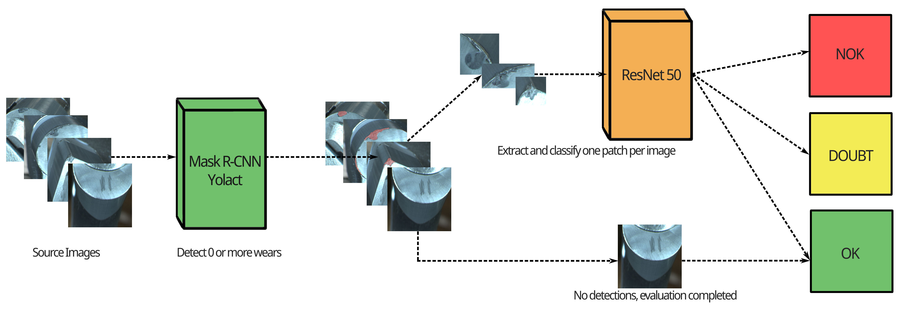

<div id="top"></div>
<!--
*** Thanks for checking out the Best-README-Template. If you have a suggestion
*** that would make this better, please fork the repo and create a pull request
*** or simply open an issue with the tag "enhancement".
*** Don't forget to give the project a star!
*** Thanks again! Now go create something AMAZING! :D
-->


<!-- PROJECT SHIELDS -->
<!--
*** I'm using markdown "reference style" links for readability.
*** Reference links are enclosed in brackets [ ] instead of parentheses ( ).
*** See the bottom of this document for the declaration of the reference variables
*** for contributors-url, forks-url, etc. This is an optional, concise syntax you may use.
*** https://www.markdownguide.org/basic-syntax/#reference-style-links
-->


<!-- PROJECT LOGO -->
<br />
<div align="center">
  <a href="https://github.com/claudiotancredi/mlinapptests">
    
  </a>

<h3 align="center">DC03 Tool Wear Classification</h3>

  <p align="center">
    A cemented carbide insert wear state classification project using instance segmentation for predictive maintenance
    <br />
    <a href="https://github.com/MLinApp-polito/mla-prj-04-dc3/tree/main/docs"><strong>Explore the docs »</strong></a>
    <br />
  </p>
</div>


<!-- TABLE OF CONTENTS -->
<details>
  <summary>Table of Contents</summary>
  <ol>
    <li>
      <a href="#about-the-project">About The Project</a>
      <ul>
        <li><a href="#built-with">Built With</a></li>
        <li><a href="#high-level-overview">High Level Overview</a></li>
        <li><a href="#high-level-overview">Repo Structure</a></li>
      </ul>
    </li>
    <li>
      <a href="#getting-started">Getting Started</a>
      <ul>
        <li><a href="#prerequisites">Prerequisites</a></li>
      </ul>
    </li>
    <li><a href="#usage">Usage</a></li>
    <li><a href="#contributors">Contributors</a></li>
  </ol>
</details>


<!-- ABOUT THE PROJECT -->
## About The Project



Monitoring tools is a fundamental process in modern factories because, by substituting worn tools with new ones, economic losses can be prevented. By using well known architectures able to solve both instance segmentation and classification tasks at the same time, it is possible to automate such process. However, manual labeling of the actual state of each worn region is time-consuming and requires the presence of highly qualified human operators. In this paper, an existing model, called baseline, has been implemented and its results have been analysed. Then, an attempt to lighten the labeling phase is proposed, by building a two-stage pipeline architecture where the first stage focuses on wear localisation and extraction by means of an architecture for instance segmentation, while the second stage performs the actual state classification for tools. In addition, to evaluate the feasibility of a real-time monitoring application, two different models that run at different fps were tested as stage 1 models. Results show that the proposed two-stage pipeline significantly outperforms the analysed baseline model and that real-time applications are viable whenever speed is preferred over prediction correctness.

<p align="right">(<a href="#top">back to top</a>)</p>


### Built With

* [Tensorflow](https://www.tensorflow.org/)
* [Pytorch](https://pytorch.org/)

<p align="right">(<a href="#top">back to top</a>)</p>


### High level overview

Two different kind of architectures with some variants that use different mask annotations (in COCO format) are available:
* The baseline model works by predicting masks for instance segmentation with the respective associated label. The insert state is then predicted matching the label assigned to the mask with the largest area.
* The two-stage pipeline, instead, uses the first stage to predict wear masks with a single possible class (WEAR); then, for each sample, the mask with the largest area is passed down as input to the second stage that performs the wear state classification. If no mask is predicted in the first stage, the sample is automatically classified as belonging to the OK class.
More info can be found in the [report](https://github.com/MLinApp-polito/mla-prj-04-dc3/blob/main/docs/04_DC3_REPORT.pdf).

### Repo Structure

* `notebooks/` contains all runnable notebooks divided in different directories by test type and architecture used. 
* `src/` contains models code, utilities, requirements for each architecture and utils for COCO annotation manipulation + split.
* `dataset/` contains the dataset class and masks annotations in COCO format.


<!-- GETTING STARTED -->
## Getting Started

Different architectures and tests are ready to be run using the appropriate notebook. The code was written to be run using Google Colaboratory, relying on Google Drive to retrieve and save important intermediate outputs.

### Prerequisites

To setup the appropriate environment prerequisites can be found in the respective section of the model that we decide to use (./src/models/*/colab-requirements.txt) and installed by doing
  ```sh
  pip install -r colab-requirements.txt
  ```
Anyway, this process is already done with an appropriate cell in each notebook.

The dataset is private, since it is offered by manufacturing industries for research purposes.

<p align="right">(<a href="#top">back to top</a>)</p>


<!-- USAGE EXAMPLES -->
## Usage

Notebooks containing all tests can be easily uploaded and run on Google Colab.
*Baseline* notebooks contains a Mask R-CNN architecture, while the pipeline proposed is composed by *Stage_1* + *Stage_2* files for each component. *Stage_1* is available for instance segmentation using Mask R-CNN or Yolact architectures.
Some generalization tests have been conducted in *Stage_1_transfer_learning* + *Stage_2_transfer_learning* notebooks.  

<p align="right">(<a href="#top">back to top</a>)</p>


<!-- CONTRIBUTING -->
## Contributors
The work was built by [Claudio Tancredi](https://github.com/claudiotancredi/), [Francesca Russo](https://github.com/frarus), [Matteo Quarta](https://github.com/coccocarmiano/), [Alessandro Versace](https://github.com/AleVersace).


<!-- MARKDOWN LINKS & IMAGES -->
<!-- https://www.markdownguide.org/basic-syntax/#reference-style-links -->
[contributors-shield]: https://img.shields.io/github/contributors/claudiotancredi/mlinapptests.svg?style=for-the-badge
[contributors-url]: https://github.com/claudiotancredi/mlinapptests/graphs/contributors
